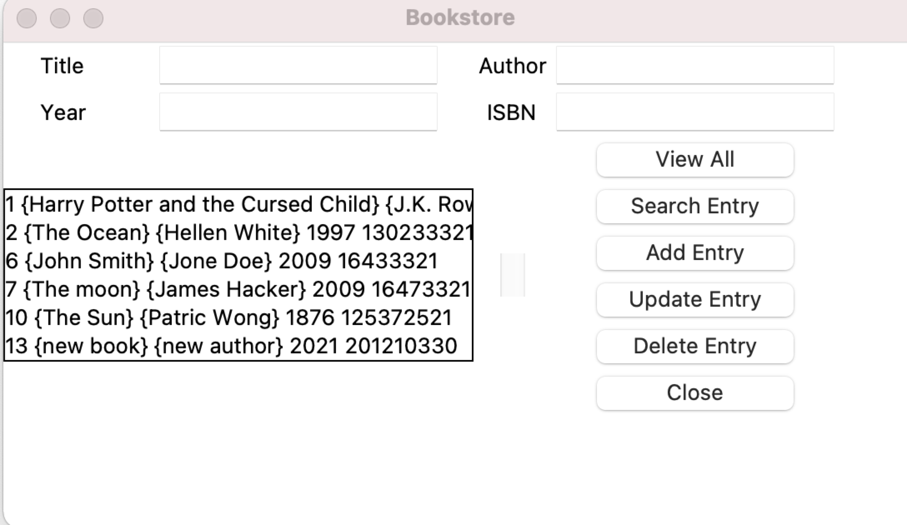
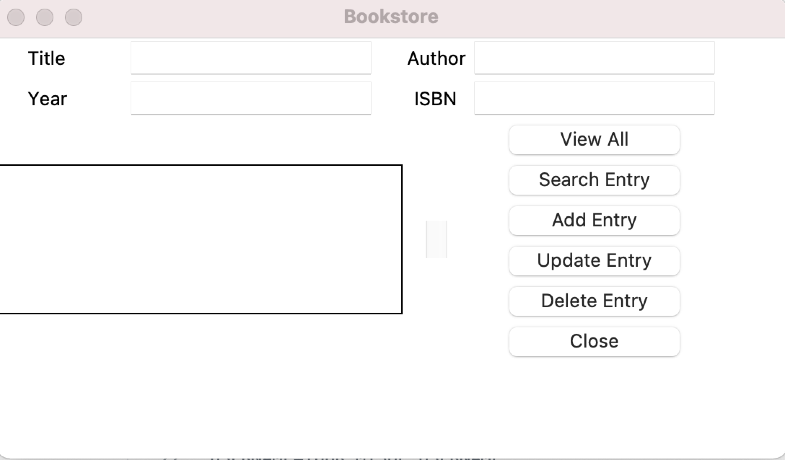

# Bookstore-Python-mysql-App
## Description
It 's a bookstore program that stores book information:
**Title, Author, Year, ISBN**

#### User's Actions:
- View all records
- Search an entry
- Add entry
- Update entry
- Delete
- Close window
## Technologies
- Front-End UI is using **Tkinter** which is standard GUI library for Python
- Back-End connect to **MySql** Database using mysql-connector.
## To Run The Program
- Python environment
- Need to download [mysql-connector](https://pypi.org/project/mysql-connector-python/)
- Need to download [python-dotenv](https://pypi.org/project/python-dotenv/)
- Create .env file add your information, which is similar to below:
```
USERNAME=YOUR_MYSQL_USERNAME
PASSWORD=YOUR_MYSQL_PASSWORD
HOST=YOUR_LOCAL_HOST
DATABASE=YOUR_DATABASE_NAME
```
- Run frontend.py file to start the application
## How the app looks like?


